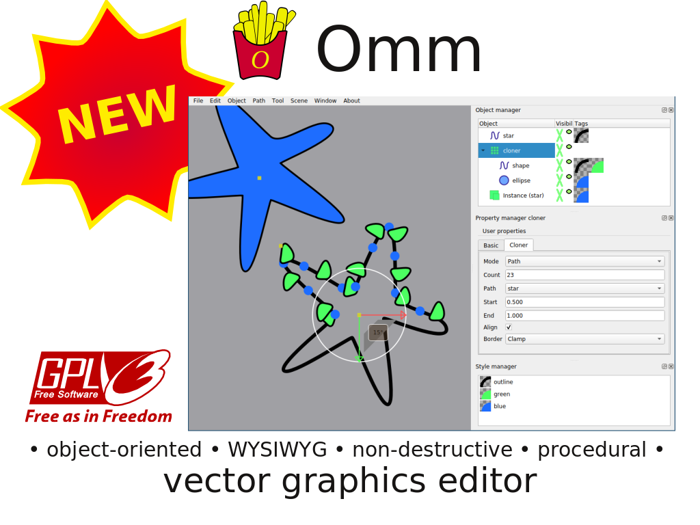
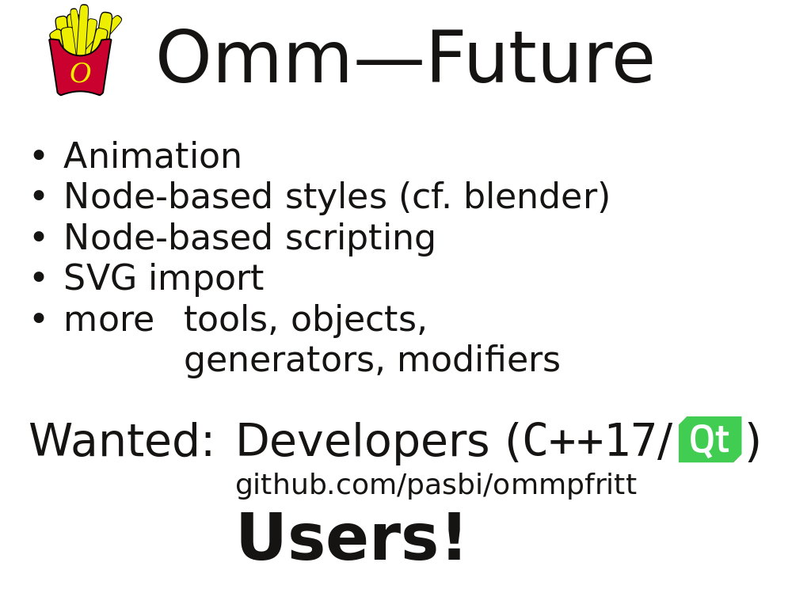

# Omm

## (1) What is omm?

- general purpose vector graphics editor
- GPL
- design goals:
  - intuitive usage
  - WYSIWYG
  - non-destructive, non-linear:
      - change anyting in the scene anytime. Few to no dialogs.
  - procedural:
      - combine generators (cloner, mirror, outliner, etc.) to create geometry based on other geometry
      - base geometry can be modified afterwards
      - procedural parameters are accessible anytime
      - also applies to styles
  - common principles in 3D-world, rather uncommon in 2D.
  - expressiveness: differentiate e.g. "inherently same" vs. "happens to be same by coincidence"
  - formulate object-dependencies (e.g., radius of that ellipse is twice the width of that rectangle)

## (2) Comparison with existing applications

- Visual editors (e.g., Inkscape) lack easy-to-use procedural and non-linear editing capabilities
- Non visual editors (e.g., TikZ) are ineligible for many users and sometimes hard to use even for programmers
- Most 3D-editors (e.g., blender) do support procedural and non-linear editing but are overkill for 2D-graphics

## (2) Current status

- Flexible, neat gui:
  - dockable managers
  - edit multiple objects at once, handle conflicting values gracefully
  - *everything* can be undone/redone, command-history
  - fully-functional visual object-tree
      - move/copy/link objects around with drag'n'drop
      - integrates tags (which add functionality or style to an object)
      - quick-access to important object properties (dis-/enabled, visibility, name)
- basic predefined shapes (Rectangle, Ellipse, Line, etc.)
- paths (auto-Bezier, manual-Bezier, linear)
- Generators generate geometry from existing geometry:
  - Cloner: arrange clones along line/ellipse/path or in grid
  - Mirror: mirror objects or paths
  - Instance: dynamically copy any object
  - Outline: in- or offset a path
- tools
  - click-select and brush-select
  - knife: add points by cutting geometry
  - others ...
- fully scriptable (Python 3) object-, style- and tag- properties
- cascading style system: combine styles
- immediate visual feedback
- PNG/SVG export
- (de-)serialize to/from json
- tested on linux/win; supposed to run on mac

## (3) Future

- keyframe- and event-based animation
- node-based styles like blender
- node-based visual scripting
- SVG import
- more tools, objects, generators and modifiers
- make more properties editable in viewport (e.g. modifiy rectangle size by dragging the rectangle edges)
- users and co-developers wanted

## (4) facts (optional)
~40k lines of code
- C++17/Qt, cmake
- it's the 3rd rewrite-from scratch of that project
- first iteration: 4-5 years ago, current rewrite: since August 2018. This is the last rewrite!
- github.com/pasbi/ommpfritt
- GPLv3
